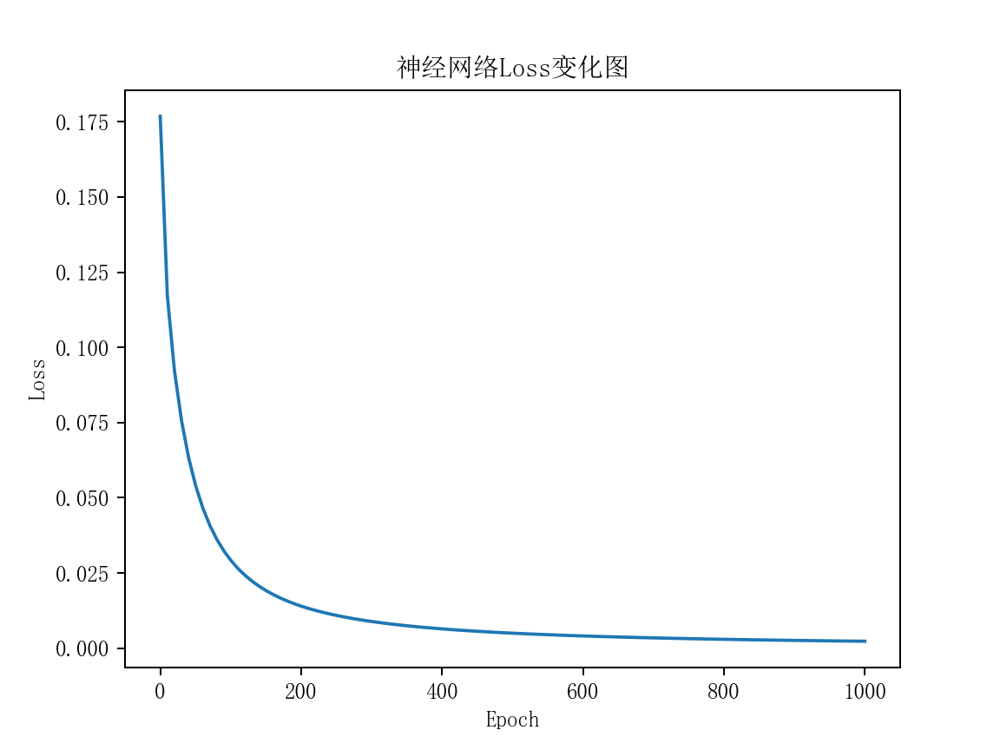

# Python手撕神经网络Demo

基础知识：
- [神经网络](https://github.com/BlankSpacePlus/python-scikit-learn#%E7%A5%9E%E7%BB%8F%E7%BD%91%E7%BB%9C)
- [Python机器学习](https://github.com/BlankSpacePlus/python-machine-learning)

训练流程：
1. 从数据集中选择一个样本
2. 计算损失函数对所有权重和偏差的偏导数
3. 使用更新公式更新每个权重和偏差
4. 重复第1步直至满足训练终止条件

数据集：

| 姓名 | 体重 | 身高 | 性别 |
|:----:|:----:|:----:|:----|
| Alice | -2 | -1 | 1 |
| Bob | 25 | 6 | 0 |
| Charlie | 17 | 4 | 0 |
| Diana | -15 | -6 | 1 |

数据集说明：
- 体重 base 135 磅
- 身高 base 66 英尺
- 性别 0 为男 1 为女

损失计算：

^{2})

结果：



```text
Epoch 0 	loss: 0.177
Epoch 10 	loss: 0.117
Epoch 20 	loss: 0.092
Epoch 30 	loss: 0.076
Epoch 40 	loss: 0.063
Epoch 50 	loss: 0.054
Epoch 60 	loss: 0.047
Epoch 70 	loss: 0.041
Epoch 80 	loss: 0.036
Epoch 90 	loss: 0.032
Epoch 100 	loss: 0.029
Epoch 110 	loss: 0.026
Epoch 120 	loss: 0.024
Epoch 130 	loss: 0.022
Epoch 140 	loss: 0.020
Epoch 150 	loss: 0.019
Epoch 160 	loss: 0.018
Epoch 170 	loss: 0.017
Epoch 180 	loss: 0.016
Epoch 190 	loss: 0.015
Epoch 200 	loss: 0.014
Epoch 210 	loss: 0.013
Epoch 220 	loss: 0.012
Epoch 230 	loss: 0.012
Epoch 240 	loss: 0.011
Epoch 250 	loss: 0.011
Epoch 260 	loss: 0.010
Epoch 270 	loss: 0.010
Epoch 280 	loss: 0.010
Epoch 290 	loss: 0.009
Epoch 300 	loss: 0.009
Epoch 310 	loss: 0.008
Epoch 320 	loss: 0.008
Epoch 330 	loss: 0.008
Epoch 340 	loss: 0.008
Epoch 350 	loss: 0.007
Epoch 360 	loss: 0.007
Epoch 370 	loss: 0.007
Epoch 380 	loss: 0.007
Epoch 390 	loss: 0.007
Epoch 400 	loss: 0.006
Epoch 410 	loss: 0.006
Epoch 420 	loss: 0.006
Epoch 430 	loss: 0.006
Epoch 440 	loss: 0.006
Epoch 450 	loss: 0.006
Epoch 460 	loss: 0.005
Epoch 470 	loss: 0.005
Epoch 480 	loss: 0.005
Epoch 490 	loss: 0.005
Epoch 500 	loss: 0.005
Epoch 510 	loss: 0.005
Epoch 520 	loss: 0.005
Epoch 530 	loss: 0.005
Epoch 540 	loss: 0.005
Epoch 550 	loss: 0.004
Epoch 560 	loss: 0.004
Epoch 570 	loss: 0.004
Epoch 580 	loss: 0.004
Epoch 590 	loss: 0.004
Epoch 600 	loss: 0.004
Epoch 610 	loss: 0.004
Epoch 620 	loss: 0.004
Epoch 630 	loss: 0.004
Epoch 640 	loss: 0.004
Epoch 650 	loss: 0.004
Epoch 660 	loss: 0.004
Epoch 670 	loss: 0.004
Epoch 680 	loss: 0.004
Epoch 690 	loss: 0.003
Epoch 700 	loss: 0.003
Epoch 710 	loss: 0.003
Epoch 720 	loss: 0.003
Epoch 730 	loss: 0.003
Epoch 740 	loss: 0.003
Epoch 750 	loss: 0.003
Epoch 760 	loss: 0.003
Epoch 770 	loss: 0.003
Epoch 780 	loss: 0.003
Epoch 790 	loss: 0.003
Epoch 800 	loss: 0.003
Epoch 810 	loss: 0.003
Epoch 820 	loss: 0.003
Epoch 830 	loss: 0.003
Epoch 840 	loss: 0.003
Epoch 850 	loss: 0.003
Epoch 860 	loss: 0.003
Epoch 870 	loss: 0.003
Epoch 880 	loss: 0.003
Epoch 890 	loss: 0.003
Epoch 900 	loss: 0.003
Epoch 910 	loss: 0.003
Epoch 920 	loss: 0.003
Epoch 930 	loss: 0.002
Epoch 940 	loss: 0.002
Epoch 950 	loss: 0.002
Epoch 960 	loss: 0.002
Epoch 970 	loss: 0.002
Epoch 980 	loss: 0.002
Epoch 990 	loss: 0.002
```
